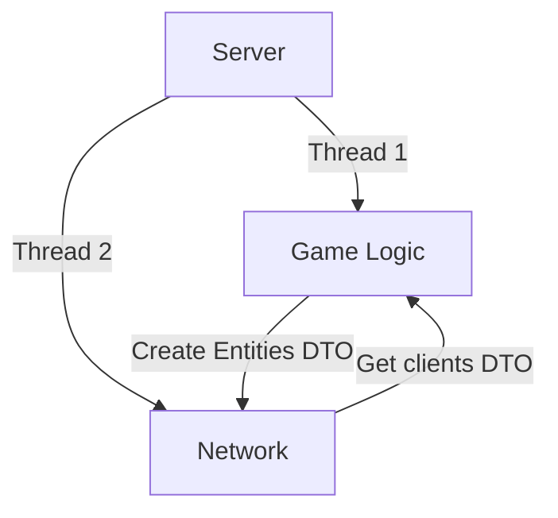

# R-Typre Reborn : Developers Documentation

## Introduction

Welcome to the developers documentation for **R-Type: Reborn**!
This document is intended for developers who wish to contribute to the project or learn more about the technologies used in the game.

### Table of Contents

- [Game Overview](#game-overview)
- [Server](#server)
- [Client](#client)
- [Networking](#networking)
- [Stellar Forge: Game Engine](#stellar-forge-game-engine)

## Game Overview

**R-Type: Reborn** is a modern reimagining of the classic arcade shoot 'em up, combining nostalgic gameplay with new features and enhancements.
We have divided the project into two key components : the server and the client.
The server component is responsible for managing the game state, handling player connections, and synchronizing game data between clients.
The client component is responsible for rendering the game world, handling player input, and displaying the game state to the player.
These components communicate over a network connection using a custom protocol designed for real-time multiplayer games.

## Server

The architecture of the server is based on a multithreaded design, with separate threads for handling network communication, game logic, and data synchronization.
Here is an overview of the server components:

## Client
The architecture of the client is based on a game loop design, with separate systems for rendering, input handling, and game state management.

