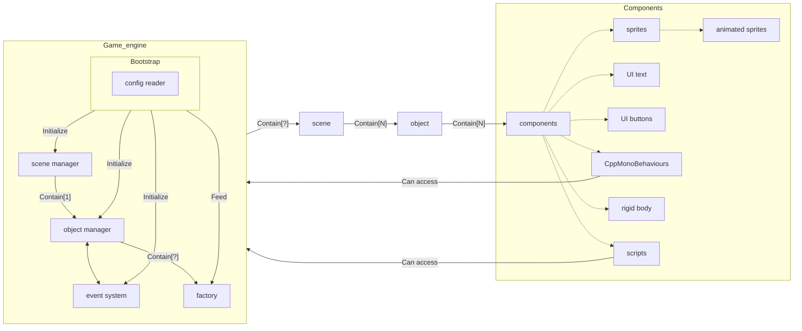

# Stellar Forge : Game Engine

## Introduction

Welcome to the developers documentation for **Stellar Forge**!
This document is intended for developers who wish to contribute to the project or learn more about the technologies used in the game engine.

## Table of Contents

- [Architecture](#architecture)
- [Components](#components)
- [Event System](#event-system)
- [Graphics System](#graphics-system)
- [Configuration](#configuration)
- [How to make changes](#how-to-make-changes)
  - [Adding new components](#adding-new-components)

## Architecture

**Stellar Forge** is a modern game engine designed to power the **R-Type: Reborn** project.
The engine is built using C++17 and leverages the SFML (Simple and Fast Multimedia Library) for graphics, audio, and input handling.

The engine is divided into several components, each responsible for a specific aspect of the game:

- **Graphic Engine**: Responsible for rendering the objects that make up the game world.
- **Config Reader**: Reads and parses configuration files to load game assets and settings.
- **Event System**: Listens for and dispatches events to the appropriate game objects.
- **Scene Manager**: Manages the game scenes, including loading, unloading, and transitioning between scenes.
- **Object Manager**: Manages the game objects, including creating, updating, and destroying objects.
- **Objects**: The game objects that make up the game world, including entities, components, and scenes.
  - **Components**: The building blocks of game objects, defining their behavior, appearance, and interactions.


Here is an overview of the Stellar Forge architecture (Yes, it's complicated):

    
## Components

Each object in the game world is composed of several components that define its behavior, appearance, and interactions.
Here are some of the key components used in **Stellar Forge**:

- **Transform**: Defines the position, rotation, and scale of an object.
- **Sprite**: Renders a 2D image on the screen.
- **Animated Sprite**: Renders a sequence of images to create an animation.
- **Rigid Body**: Simulates physics interactions between objects.
- **UI Text**: Displays text on the screen.
- **CppMonoBehaviours**: Allows developers to attach C++ scripts to game objects.

(All these components are already implemented in the engine, and you can use them to create your game objects.)

### CppMonoBehaviours

The `CppMonoBehaviours` component allows developers to attach C++ scripts to game objects.
These scripts can be used to define custom behavior, interactions, and game logic for the objects.
To write a C++ script, you need to inherit from the `CppMonoBehaviour` class and implement the `update` method.
You can also use the `start`, `end`, `before` and `after` methods to perform initialization and cleanup tasks.


## Event System

The event system in **Stellar Forge** is responsible for listening for and dispatching events to the appropriate game objects.
Events are used to communicate between different parts of the game, such as input handling, collision detection, and object interactions.
You can register event listeners in your game objects to respond to specific events, such as key presses, mouse clicks, or collisions.

By default, the graphic engine triggers all events linked to the window (like key press, etc).
*(if the user press the `Z` key, the engine will trigger an event with the name `z_pressed`)*
You can also trigger custom events in your game objects to communicate between them.

For example, you can listen for the `Z` key press event and move the player object when the key is pressed.
To do this, you need to register an event with the name `z_pressed` and a callback function that moves the player object.

## Graphics System

The **Graphics System** in **Stellar Forge** is responsible for rendering the visual elements of the game, including objects, animations, UI components, and more. It leverages the **SFML** (Simple and Fast Multimedia Library) to handle low-level graphics operations such as drawing sprites, managing textures, and controlling the game window.

The system is designed to be modular and flexible, allowing developers to easily extend it with custom rendering components or integrate third-party libraries if needed.

### Key Components of the Graphics System

TODO
Graphics class (detail)
Graphics Components (detail)

### Render Pipeline

The rendering process follows a pipeline-based approach. At each frame, the system:

1. **Clears the screen**: The screen is cleared to a predefined color (e.g., black or transparent).
2. **Draws background elements**: Background objects (like tiles or static scenery) are rendered first.
3. **Draws game objects**: The engine loops through all active objects in the current scene and draws their associated components, such as sprites or UI elements.
4. **Draws UI elements**: UI elements are drawn on top of the game objects, ensuring that they remain visible and interactive.
5. **Displays the final frame**: Once all objects are rendered, the screen is updated to show the final frame.

### Customizing the Graphics System

If you need to customize the graphics system, you can:

- **Add new rendering components**: Inherit from the `IGraphicComponent` interface to create custom rendering components, such as particle effects or shader-based visual effects.
  
- **Override the renderer**: You can extend the `Renderer` class if you need to modify how objects are drawn, such as implementing post-processing effects or custom rendering techniques.

- **Modify the UI system**: The UI system can be extended with new components or customized for specific games. For example, you could create a new `UI ProgressBar` component to display player health or loading screens.

### Integration with the Event System
The graphics system is tightly integrated with the Event System. For instance, window-related events like resizing or closing the window are handled by both the graphics and event systems. Key events (like z_pressed) can trigger changes in the graphics (e.g., changing a sprite's texture or visibility).

By default, the graphics system listens to all window events and updates the render window accordingly.

### Key Components of the Graphics System

The **Graphics System** in Stellar Forge handles all visual aspects of the game, such as rendering sprites, animations, and UI elements. It provides the necessary tools and abstractions for managing visual content and drawing them onto the screen.

#### Graphics Class

The `Graphics` class serves as the core interface between the game engine and the underlying graphics library (e.g., SFML). It is responsible for managing the main game window, coordinating the rendering process, and providing essential methods for drawing game objects.

##### Responsibilities of the `Graphics` Class:
- **Window Management**: It creates and manages the game window, allowing the engine to handle window resizing, closing, and other window-related events.
- **Render Loop**: It manages the main render loop, which includes clearing the screen, drawing all game objects, and displaying the final frame.
- **Frame Rate Control**: It can control the frame rate of the game by managing the time between frames, ensuring smooth rendering.
- **Rendering Context**: It ensures that the correct rendering context is active for drawing operations and integrates with the event system to process window-related events.

##### Key Methods:
- `initialize()`: Sets up the game window and any necessary resources for rendering.
- `clear(color)`: Clears the screen with the specified color before drawing any objects.
- `draw(object)`: Draws a game object (like sprites or UI elements) onto the screen.
- `display()`: Displays the rendered frame on the screen.
- `handleWindowEvents()`: Manages window events such as resizing or closing.
- `setFrameRateLimit(fps)`: Limits the frame rate of the game to a specified number of frames per second.

#### Graphics Components

All graphics components in Stellar Forge inherit from the `IGraphicsComponent` interface. This interface defines the structure and functionality for graphics-related components. Any component that handles graphics or rendering should inherit from this interface and implement its methods.

##### Responsibilities of the `IGraphicsComponent` Interface:
- **Rendering**: The interface requires derived classes to implement a method that handles the rendering of the component on the screen.
- **Size Retrieval**: It mandates a method for obtaining the size of the component, allowing for proper layout and management of visual elements.

### Changing the Graphics Library

If you want to switch the underlying graphics library (e.g., from SFML to SDL, OpenGL, or Vulkan), you would primarily need to modify the `Graphics` class to interact with the new library. Here are the key steps involved:

1. **Replace Specific Calls**: You would need to replace any library-specific calls (such as those used in SFML) with the equivalent API from the new graphics library.

2. **Ensure Method Compatibility**: It is essential to verify that methods like `initialize()`, `draw()`, and `display()` are correctly implemented using the new library's functionality. This ensures that the overall rendering process remains intact and functional with the new graphics API.

3. **Update Render Implementations**: You will also need to change all render implementations in the components that inherit from `IGraphicsComponent`. Each component’s rendering logic must be adjusted to comply with the new graphics library's API, ensuring that visual elements are rendered correctly on the screen.

By following these guidelines, the graphics system can be adapted to work with various libraries while maintaining a consistent interface for the rest of the game engine.


## Configuration

**Stellar Forge** uses configuration files to load you game objects, scenes, and settings.
The configuration files are written in JSON format and are located in the `assets` directory.

Here is an example of a configuration file for a game object:
```json
{
  "id": "9f19e43c-990b-4314-a039-d729a1dab876",
  "meta": {
    "name": "Ally"
  },
  "isActive": false,
  "child": [],
  "components": [
    {
      "name": "Transform",
      "data": {
        "position": {
          "x": 0,
          "y": 0,
          "z": 0
        },
        "rotation": {
          "x": 0,
          "y": 0,
          "z": 0
        },
        "scale": {
          "x": 1,
          "y": 1,
          "z": 1
        }
      }
    },
    {
      "name": "Sprite",
      "data": "client/objects/assets/ally.png"
    }
  ]
}
```
The configuration file contains the following fields:
- **id**: A unique identifier for the object (UUID).
- **meta**: Additional metadata about the object, such as its name.
- **isActive**: Whether the object is active or not.
- **child**: An array of child objects.
- **components**: An array of components that define the object's behavior and appearance.

Each component has a name and data field that contains the component-specific settings.

Here is an example of a configuration file for a scene:
```json
{
  "id": "4548bf85-6bb2-4ba7-88bf-856bb22ba7d1",
  "objects": [
    "9f19e43c-990b-4314-a039-d729a1dab876"
  ]
}
```

The scene configuration file contains the following fields:
- **id**: A unique identifier for the scene (UUID).
- **objects**: An array of object IDs that belong to the scene.

## How to make changes

If you want to contribute to **Stellar Forge** or make changes to the engine, here are some guidelines to follow:

### Adding new components

To add a new component to the engine, follow these steps:

1. Create a new class that inherits from the `IComponent` interface or one of its subclasses (e.g., `AComponent`).
   *(If you want to create a new graphic component, you have to also inherit from the `IGraphicComponent` interface)*
2. Implement the required methods for the component, such as `update`, `clone`, `deserialize` and `serializeData`.
*(If you don't use the abstract class `AComponent`, you will have to implement all the methods of the `IComponent` interface)*
3. Register the new component in the `ComponentFactory` class so that it can be created dynamically.
4. Use the new component in your game objects by adding it to the object's configuration file.

Now you can use your new component in the engine to create custom game objects with unique behavior and appearance.

You can propose your changes to the project maintainers for review and integration into the main codebase.
